# Trading App 💹  

**Trading App** is a Ruby on Rails web application that simulates stock trading with role-based access for both **Admins** and **Users**.  
It provides authentication, admin approval, portfolio management, and trading features — all designed with **TailwindCSS** for a modern UI.  

---

## ✨ Features  

### 🔒 Authentication & Authorization  
- Secure signup, login, and logout using **Devise**  
- Role-based access for **Admins** and **Users**  
- **Admin approval/rejection** flow for new users  

### 📊 Admin Features  
- Create new users directly from the admin panel  
- View all registered users  
- Manage pending user approvals  
- View all transactions across all accounts  

### 👤 User Features  
- **Portfolio Page** – View owned stocks and holdings  
- **Trade Page** – Buy and sell stocks easily  
- **Transactions Page** – Track all personal trades and history  

### 🖥️ General Pages  
- Landing page with introduction
- Dedicated login and signup pages

---

## 🛠️ Tech Stack  

- **Backend**: Ruby on Rails  
- **Frontend**: ERB + Tailwind CSS  
- **Authentication**: Devise
- **Pagination**: Kaminari  
- **Search & Filtering**: Ransack  
- **Environment Management**: Dotenv  
- **Database**: PostgreSQL  

---

## 📸 Screenshots  

### 🏠 Landing Page  
First impression of the app with call-to-action. 

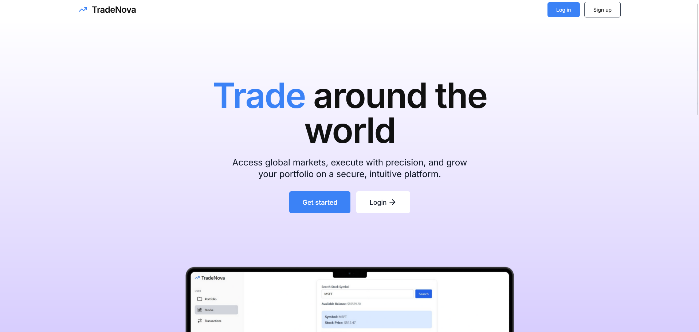  

### 🔑 User Authentication (Sign Up & Login)  
- Secure signup and login for users  
- New users require admin approval before access  
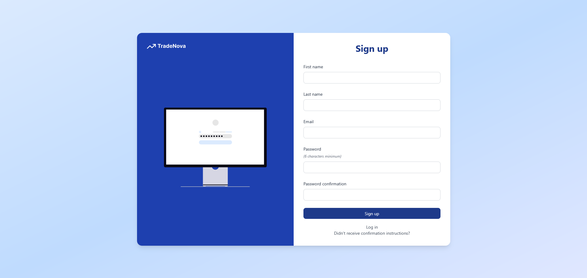  
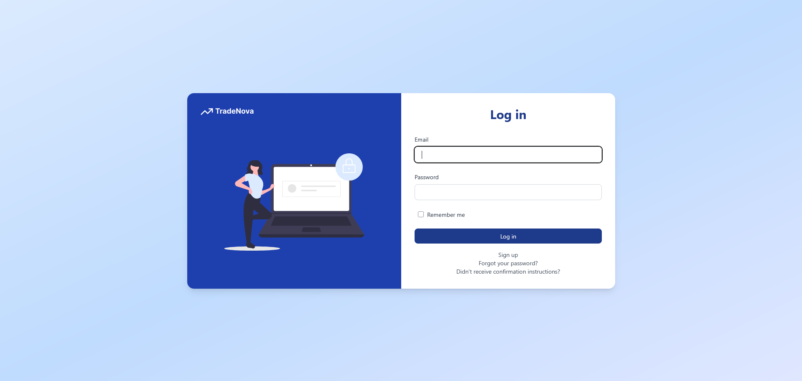   

### 💼 User Portfolio Page  
- Overview of owned stocks and their performance  
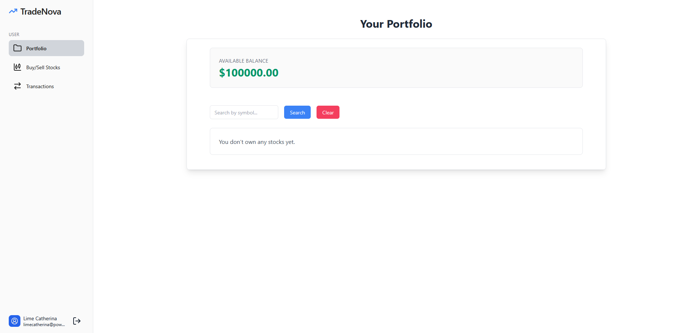  
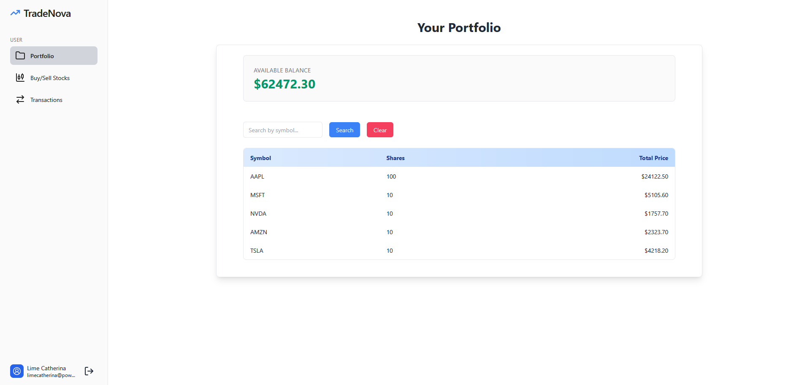  

### 📈 Trade Page  
- Buy and sell stocks seamlessly  
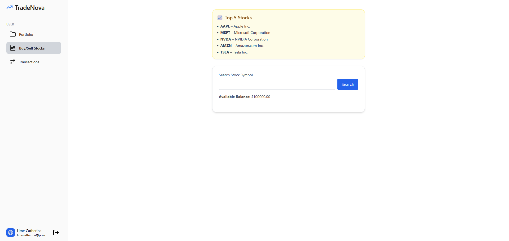   
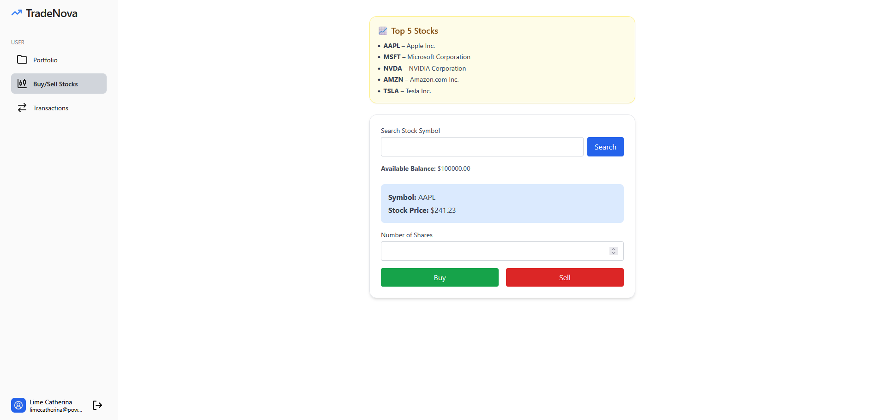   

### 📜 User Transactions  
- View personal trading history  
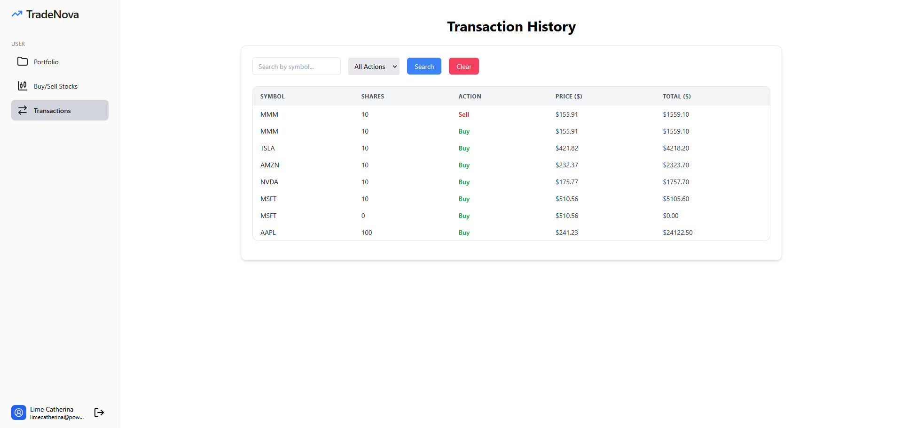   

### 📋 Admin Pages 
- Create new users directly  
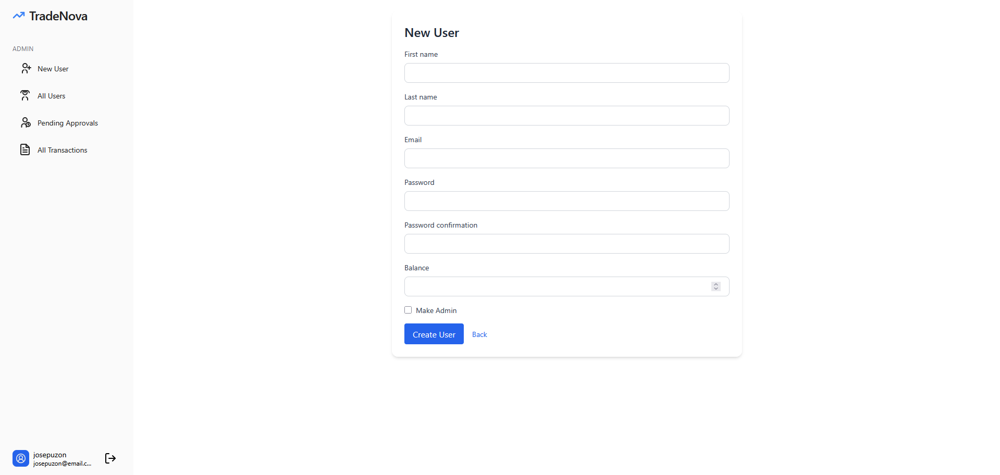  
- View all users  
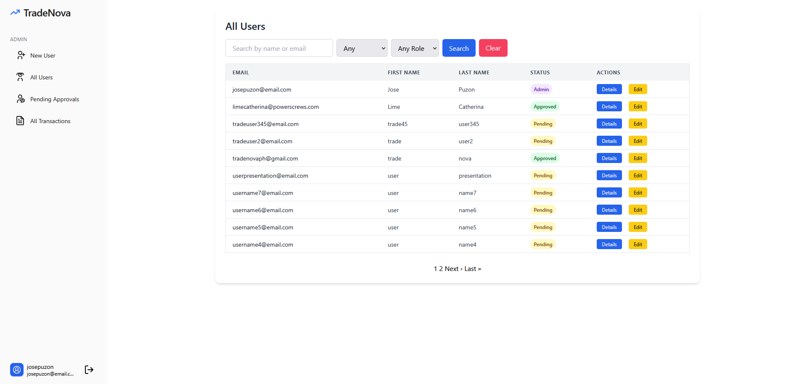  
- Manage pending approvals  
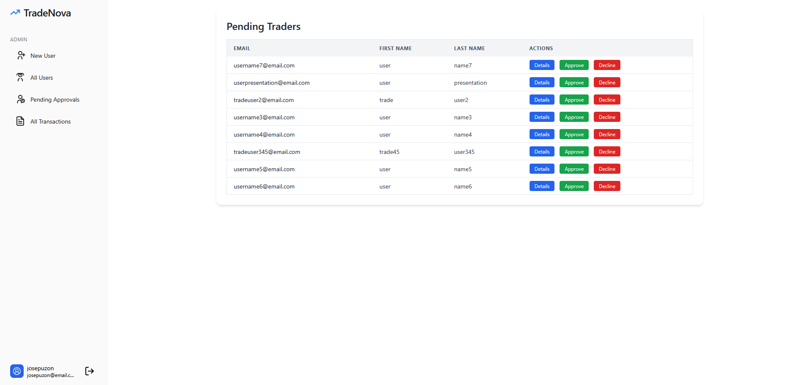  
- View all transactions across accounts  
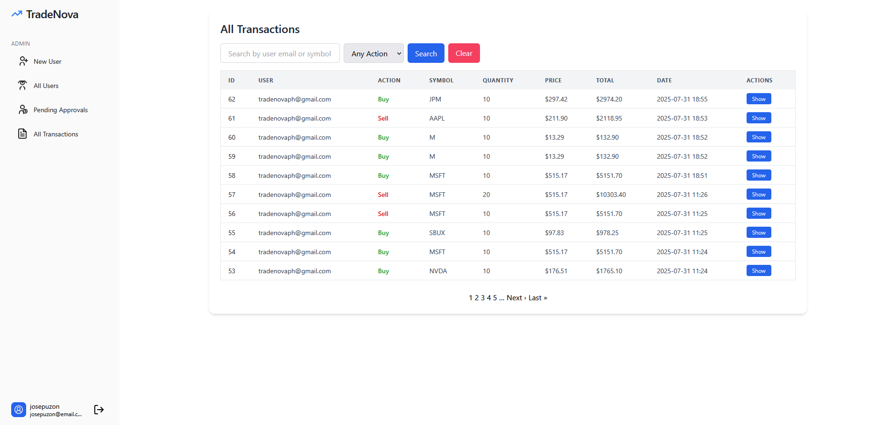  

## 👥 Developed By

- emmant-web
- josepuzon